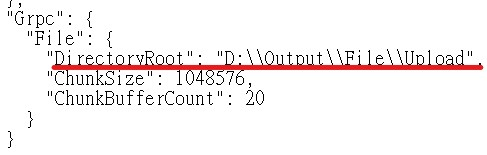
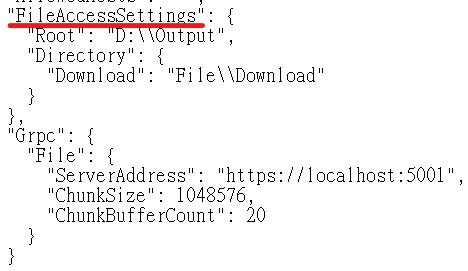
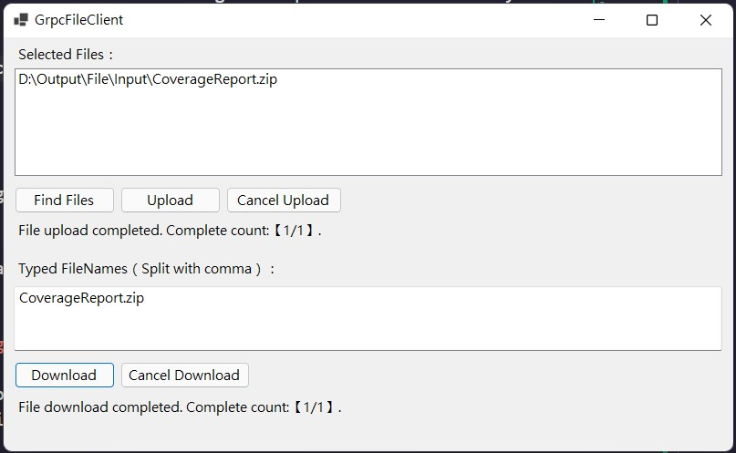
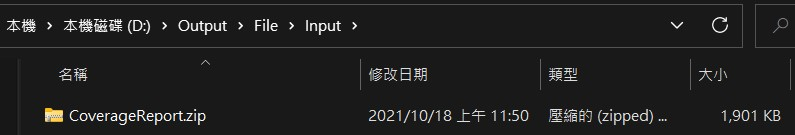
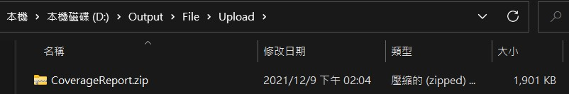
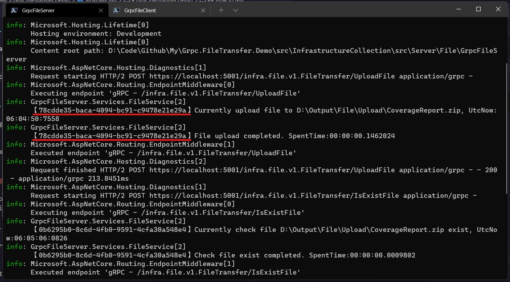
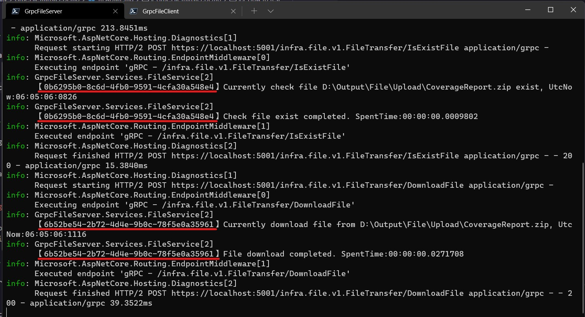

# Grpc.FileTransfer.Demo

透過 gRPC 示範如何上下傳檔案。  
Demo how to upload/download file with gRPC.

## How to test

> 複製這個儲存庫。

1. Clone this repo.

   ```
   git clone https://github.com/cdcd72/Grpc.FileTransfer.Demo.git
   ```

> 至示範資料夾位置並初始化需要的子模組。

2. Go to demo directory and init needed submodule.

   ```
   cd Grpc.FileTransfer.Demo
   git submodule init
   git submodule update
   ```

> 至 GrpcFileServer 目錄並配置你偏好的上傳目錄路徑。

3. Go to GrpcFileServer directory and configure your perfer upload directory path.

   ```
   cd src\InfrastructureCollection\src\Server\File\GrpcFileServer
   ```

   ```
   notepad appsettings.json
   ```

   

> 將 GrpcFileServer 跑起來。

4. Run GrpcFileServer. ( gRPC server )

   ```
   dotnet run
   ```

> 打開另一個終端機並至 GrpcFileClient 目錄。

5. Open another terminal then go to GrpcFileClient directory.

   ```
   cd src\GrpcFileClient
   ```

> 配置你偏好的下載目錄路徑。

6. configure your perfer download directory path.

   ```
   notepad appsettings.json
   ```

   

   PS. you don't change gRPC server address, because of we test in local system.

> 將 GrpcFileClient 跑起來。

7. Run GrpcFileClient. ( gRPC client )

   ```
   dotnet run
   ```

> 嘗試使用使用者介面來上傳/下載檔案。

8. Try use UI to upload/download file.

   

   Directory structure

   - Input: you want to upload files in local.

   - Upload: simulation uploaded files in server.

   - Download: simulation downloaded files in local.

   

   

   

   

   Terminal information

   - Upload

     

   - Download

     
